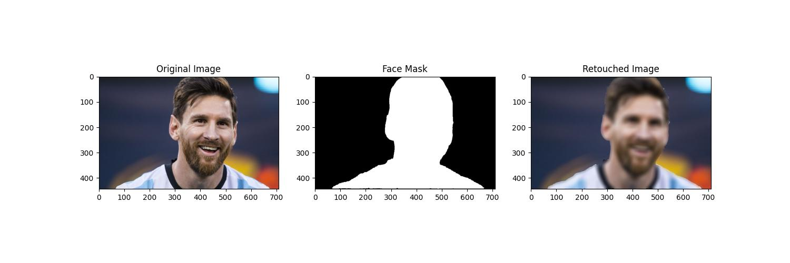

# Human subject blur with SAM

This project uses Facebook's Segment Anything Model (SAM) to detect and mask faces in images for targeted blurring.

## Features

- Face detection using OpenCV
- Precise Human masking using SAM
- Basic skin Blur with Gaussian blur
- Visualization of original, mask, and retouched images

## Installation

```bash
pip install transformers pillow torch opencv-python numpy matplotlib
```

## Usage

```python
from face_retouch import mask_and_retouch_face

input_image = "path/to/your/image.jpg"
output_image = "path/to/output/retouched.jpg"
mask_and_retouch_face(input_image, output_image)
```

## Example


